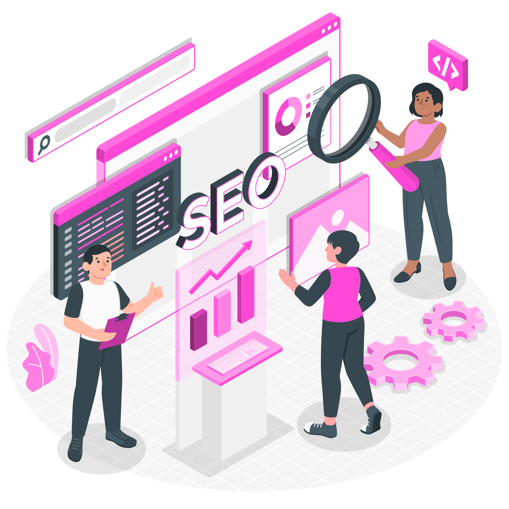

# Creare site Ploiesti: afaceri locale care apar pe Google si aduc clienti

Daca ai o afacere in Ploiesti si inca nu ai un site web profesional, pierzi in fiecare zi potentiali clienti care cauta online serviciile tale. Statisticile arata ca 87% dintre romani cauta pe Google inainte sa cumpere orice serviciu sau produs. In Ploiesti, concurenta creste de la luna la luna, iar crearea unui site pentru afaceri in Ploiesti devine o necesitate, nu un lux.

Am lucrat cu peste 50 de afaceri locale din Prahova in ultimii 3 ani. De la saloane de frumusete la clinici stomatologice si restaurante, am vazut cum un site bine realizat poate transforma complet o afacere locala.

Mai jos iti explic tot ce trebuie sa stii despre creare site Ploiesti, cat costa, cat dureaza si cum alegi agentia potrivita pentru afacerea ta.

## De ce are afacerea ta din Ploiesti nevoie de un site web

Multe afaceri mici din Ploiesti cred ca o pagina pe Facebook e suficienta. Gresit. Facebook e excelent pentru engagement, dar nu te ajuta sa apari pe Google cand cineva cauta "salon Ploiesti" sau "clinica stomatologica Ploiesti".

Un studiu realizat in 2024 pe piata romaneasca arata ca 73% dintre utilizatori ignora complet afacerile care nu au site web. Considera ca nu sunt profesioniste sau ca nu mai sunt in activitate.

Iata ce pierzi fara un site:

**Vizibilitate pe Google.** Clientii cauta zilnic pe Google servicii locale. Fara site optimizat SEO, esti invizibil pentru ei.

**Credibilitate.** Un site profesional transmite incredere. Clientii compara intotdeauna mai multe optiuni. Daca nu ai site, automat pari mai putin credibil decat concurenta.

**Rezervari online.** In 2025, oamenii vor sa rezerve online, nu sa sune. Un sistem de booking integrat poate creste rezervarile cu pana la 200%.

**Control asupra imaginii.** Pe Facebook sau Google Maps depinzi de platforma. Pe site-ul tau, controlezi mesajul si experienta utilizatorului.

Un exemplu concret: Salonul de Micropigmentare by Paula Lupu din Ploiesti a implementat un site cu sistem de rezervari in martie 2022. In prima luna, 40% din rezervari au venit online. Dupa 3 luni, acest procent a crescut la 65%, iar numarul total de rezervari a crescut cu 180%.

## Creare site Ploiesti: cat costa si ce primesti

Una dintre cele mai frecvente intrebari pe care le primesc: cat costa creare site Ploiesti?

Raspunsul corect: depinde de ce vrei. Preturile variaza enorm, de la 300€ pentru un site rapid cu o singura pagina, pana la 10.000€+ pentru solutii enterprise.

### Pachetele noastre pentru afaceri locale

**START RAPID - 1.480 RON** (economie 370 RON)

Pentru afaceri la inceput de drum.
- Site prezentare 1-3 pagini optimizat mobil
- Logo profesional inclus
- Configurare Google Business Profile (harta + program)
- Optimizare SEO de baza (titluri, descrieri, viteza)
- Instalare Google Analytics
- Rezultat garantat: Vizibilitate online in 7 zile si prezenta pe Google Maps

**MAGNET DE CLIENTI - 2.480 RON** (economie 620 RON)

Pentru firme care vor mai multe contacte. Cel mai ales pachet.
- Site complet 5-7 pagini (acasa, servicii, preturi, testimoniale, contact)
- Logo inclus
- Optimizare SEO locala completa (cuvinte-cheie + indexare rapida)
- Copywriting persuasiv (texte orientate spre conversii)
- Formular contact + integrare WhatsApp sau Messenger
- Termen livrare: 7-10 zile lucratoare
- Rezultat garantat: Aparitii in cautarile locale si clienti din prima luna

**CRESTERE ACCELERATA - 3.960 RON** (economie 990 RON)

Pentru companii care vor dominare locala.
- Tot ce include Magnet de Clienti
- Blog integrat + 3 articole SEO optimizate
- Chatbot inteligent pentru clienti (WhatsApp sau site)
- Optimizari lunare timp de 3 luni (raport lunar + ajustari SEO)
- Consultanta strategica 1-la-1 (o sedinta/luna timp de 3 luni)
- Rezultat garantat: Crestere a traficului cu +50% si primele pozitii in Google local

Clientii care aleg pachetul Magnet de Clienti primesc de obicei primele contacte in primele 2 saptamani. Pachetul Crestere Accelerata este recomandat pentru afaceri care vor sa devina lideri de piata locali.

## Cum sa alegi cea mai buna agentie de creare site Ploiesti

Nu toate agentiile sunt create egale. Am vazut site-uri "profesionale" care nu se incarca pe mobil sau care nu apar deloc pe Google.

Iata ce sa verifici inainte sa semnezi contract:

**Portofoliu real si verificabil.** Cere exemple concrete de site-uri create. Nu poze, ci link-uri functionale. Verifica daca site-urile se incarca repede si arata bine pe mobil.

**Rezultate SEO dovedite.** Oricine poate face un site frumos. Putini pot sa-l faca vizibil pe Google. Cere studii de caz cu cresteri masurabile de trafic si conversii.

**Intelegerea afacerii tale.** O agentie buna iti pune intrebari despre clientii tai, concurenta, obiectivele de business. Daca vor doar sa iti vanda un pachet standard fara sa te asculte, fugi.

**Transparenta la costuri.** Trebuie sa stii exact ce primesti si cat platesti. Zero costuri ascunse, zero "taxe de mentenanta" nespecificate.

**Suport dupa lansare.** Ce se intampla daca ceva nu functioneaza? Daca vrei sa modifici ceva? Asigura-te ca ai suport inclus cel putin 30 zile.

**Testimoniale locale.** Cauta recenzii de la afaceri similare cu a ta din Ploiesti sau Prahova. Daca toti clientii lor sunt din Bucuresti sau alte orase, poate ca nu inteleg specificul pietei locale.

Un semn rau: agentii care promit "pozitia 1 pe Google garantat in 30 zile". SEO-ul real ia timp, mai ales pe o piata competitiva. Fii suspicios la promisiuni exagerate.

## Creare site Ploiesti pentru saloane de frumusete

Lucrez des cu saloane de coafura, beauty salons, studiouri de manichiura si centre spa din Ploiesti. Industria beauty are nevoie speciala de un anumit tip de site.

### Ce trebuie sa contina un site de salon

**Galerie foto impresionanta.** Clientii vor sa vada munca ta inainte sa rezerve. Poze profesionale, de calitate inalta, cu lucrari recente, nu poze neclare sau calitate proasta cu logo-uri peste.

**Sistem de rezervari online integrat.** Cel putin 60% dintre clientele de salon vor sa rezerve online. Lumea nu mai vrea sa sune pentru rezervari. Unul dintre avantajele integrarii cu calendar este confirmare automata prin SMS/email si reminder-uri.

**Lista completa de servicii si preturi.** Fii transparent. Clientii detesta sa sune sa intrebe pretul. Afiseaza clar ce servicii oferi si cat costa.

**Prezentare echipa.** Oamenii vor sa stie clar cine ii astepta. Foloseste poze profesionale cu stilistii, scurte biografii, specializari.

**Recenzii cliente.** Dovezile si veridicitatea informatilor este esentiala. Integreaza recenziile Google si Facebook direct pe site.

**Blog cu sfaturi de beauty.** Iti creste autoritatea si te ajuta la SEO. Articole despre ingrijirea parului, tendinte makeup, cum sa iti mentii manichiura, sau alte mici trucuri te ajuta.

### Studiu de caz: Micropigmentare by Paula Lupu Elegance Ploiesti

Am inceput colaborarea cu salonul de Micropigmentare by Paula Lupu in 2021. Aveau doar o pagina de Facebook cu putini urmaritori. Rezervarile veneau doar prin telefon si multi clienti sunau sa intrebe programul sau preturile.

Am creat un site profesional cu:
- Design elegant care reflecta brandul salonului
- Sistem de rezervari online cu Calendly integrate
- Galerie cu peste 100 de poze profesionale
- Blog cu 12 articole despre ingrijirea sprancenelor si tendinte
- Optimizare SEO pentru "micropigmentare sprancene Ploiesti", "mcropigmentare Ploiesti", "micropigmentare sprancene"

**Rezultate dupa 3 luni:**
- 180% crestere in numarul de rezervari
- 65% din rezervari au venit online
- Site-ul apare in primele pozitii pentru "micropigmentare Ploiesti" si pentru "micropigmentare sprancene Ploiesti"
- Trafic organic: de la 0 la 1.200+ vizitatori/luna

Proprietara ne-a spus ca site-ul a fost cea mai buna investitie facuta pentru salon in ultimii 5 ani.

## Creare site Ploiesti pentru clinici medicale si stomatologice

Clinicile au nevoie de un alt tip de site decat saloanele. Aici vorbim de sanatate, deci increderea este esentiala.

### Elemente esentiale pentru site-uri medicale

**Prezentare completa echipa medicala.** Diplome, specializari, experienta. Clientii vor sa stie ca sunt in maini bune.

**Descriere detaliata servicii medicale.** Explica procedurile, beneficiile, contraceptiile, recuperare. Educa pacientii.

**Programare online pacienti.** Reduce numarul de apeluri telefonice si face procesul mai eficient.

**Sectiune intrebari frecvente.** Raspunde la temerile comune ale pacientilor.

**Certificari si acreditari.** Afiseaza clar toate certificarile, membru in asociatii medicale, acreditari.

**Blog medical educativ.** Articole scrise sau validate de medici, nu copiate de pe internet. Google penalizeaza site-urile medicale cu continut de proasta calitate.

**Politica GDPR clara.** Clinicile gestioneaza date sensibile. Trebuie sa fii in regula cu legislatia.

### Studiu de caz: Clinica Dent Excellence

Clinica Dent Excellence din Ploiesti ne-a contactat in aprilie 2024. Aveau un site vechi, neoptimizat, care nu genera niciun pacient nou. Dependeau 100% de recomandari.

Am reconstruit complet site-ul:
- Design modern, profesional, care inspira incredere
- Prezentare detaliata a celor 4 medici, cu experienta si specializari
- 15 pagini dedicate fiecarei proceduri (implanturi, fatete, albire, ortodontie)
- Sistem de programare online integrate cu software-ul clinicii
- Blog cu 20 de articole medicale scrise si validate de medicii clinicii
- Optimizare SEO pentru "implant dentar Ploiesti", "clinica stomatologica Ploiesti", "fatete dentare Ploiesti"

## Optimizare SEO locala Ploiesti: cum sa apari pe Google

Poti avea cel mai frumos site din lume. Daca nu apare pe Google, e inutil. SEO local e diferit de SEO clasic.

### Strategia noastra de SEO local pentru Ploiesti

**Cercetare keyword locala.** Nu optimizam pentru "salon", ci pentru "salon Ploiesti", "coafor Ploiesti Nord", "manichiura Bd Republicii Ploiesti". Keyword-urile locale au mai putina competitie si clienti mai calificati, adica vanzari mai multe in cel mai scurt timp.

**Optimizare Google Business Profile.** Profilul tau de Google Maps trebuie sa fie 100% completat, cu poze profesionale, program actualizat, recenzii positive. 46% dintre cautarile Google au intentia locala.

**Citari locale (NAP consistency).** Numele, adresa si telefonul clinicii trebuie sa fie identice pe toate platformele: Google, Facebook, Pagini Aurii, site-ul tau, directoare locale.

**Continut local.** Articole care mentioneaza Ploiestiul, cartiere specifice, evenimente locale. Google intelege ca esti relevant pentru acea zona.

**Link building local.** Link-uri de la alte afaceri din Ploiesti, presa locala, directoare din Prahova. Link-urile locale au greutate mai mare pentru SEO local.

**Recenzii Google.** Cu cat ai mai multe recenzii pozitive, cu atat mai sus apari in cautarile locale. Incurajeaza clientii tai sa lase recenzii.

**Schema markup local.** Cod special care ajuta Google sa inteleaga ca esti o afacere locala din Ploiesti.

Un exemplu: Beauty Studio Central din Ploiesti a implementat strategia noastra de SEO local in mai 2024. In 4 luni, traficul organic a crescut cu 90%, iar acum apare in top 3 pentru "manichiura Ploiesti", "pedichiura Ploiesti", "gel lac Ploiesti".

## Cel mai bun design pentru site-uri din Ploiesti

Design-ul nu e doar despre "arata frumos". Un site bine proiectat converteste vizitatori in clienti.

### Principii de design care vand

**Viteza de incarcare sub 3 secunde.** 53% dintre vizitatori parasesc site-ul daca se incarca mai mult de 3 secunde. Optimizam fiecare imagine, fiecare linie de cod.

**Design responsive.** In 2025, peste 70% dintre cautarile pe Google se fac pe mobil. Site-ul tau trebuie sa arate perfect pe orice ecran.

**Call to action vizibile.** In fiecare pagina, trebuie sa fie clar ce vrei ca vizitatorii sa faca: suna, rezerva, completeaza formular.

**Imagini profesionale.** Zero poze stock cu modele copiate de pe internet. Trebuiesc poze reale, cu afacerea ta, echipa ta, clientii tai.

**Navigatie simpla.** Vizitatorii trebuie sa gaseasca ce cauta in maxim 3 click-uri. Meniu clar, structura logica.

**Culori si fonturi potrivite industriei.** Un salon de beauty poate fi roz. O clinica medicala trebuie sa fie profesionala, cu alb, albastru, nuante de incredere.

**Sectiune de intrebari frecvente vizibile.** Raspunde la cele mai des intalnire intrebari inainte ca vizitatorul sa inchida siteul.

Am observant ca site-urile care respecta aceste principii au o rata de conversie de 3-5 ori mai mare decat site-urile generale.

## Unde sa alegi crearea unui site in Ploiesti: de ce sa alegi SiteAgency.ro

Pe piata din Ploiesti exista peste 20 de agentii si freelanceri care ofera servicii de creare de siteuri. De ce sa lucrezi cu noi?

**Experienta locala.** Am lucrat cu peste 50 de afaceri din Prahova. Stim piata, stim concurenta, stim ce cauta clientii din Ploiesti.

**Rezultate dovedite.** Nu promitem, livram. Toti clientii nostri au studii de caz cu rezultate masurabile: crestere trafic, crestere rezervari, crestere vanzari.

**Transparenta totala.** Stii exact ce platesti si ce primesti. Zero costuri ascunse. Contract clar, termeni clari.

**Suport si mentenanta incluse.** Nu te lasam singur dupa lansare. Oferim training complet, documentatie si suport tehnic.

**Pachet complet.** Nu doar cream site-ul. Oferim strategie, continut, SEO, training. Totul ce ai nevoie sa reusesti online.

**Preturi corecte.** Nu suntem cei mai ieftini, dar oferim cel mai bun raport calitate-pret din Ploiesti. Investieste corect de prima data, nu repara in fiecare luna.

Un client ne-a spus recent: "Am lucrat cu alte 2 agentii inainte sa va gasesc. Amandoua mi-au promis luna de pe cer, dar au livrat un site care nu genereaza vanzari. Cu voi, in 3 luni am recuperat investitia si mai mult."

## Cat dureaza creare site Ploiesti

Depinde de complexitate, dar iata un timeline realist:

**Pachet Starter: 2 saptamani**
- Zi 1-2: Brief, cercetare, strategie
- Zi 3-7: Design si aprobare
- Zi 8-12: Dezvoltare si continut
- Zi 13-14: Testare, ajustari, lansare

**Pachet Professional: 3-4 saptamani**
- Saptamana 1: Brief, cercetare competitie, strategie SEO
- Saptamana 2: Design custom si aprobari
- Saptamana 3: Dezvoltare, integrari, continut
- Saptamana 4: Testare, SEO on-page, training, lansare

**Pachet Premium: 6-8 saptamani**
- Saptamana 1-2: Cercetare aprofundata, strategie completa marketing
- Saptamana 3: Design premium si animatii
- Saptamana 4-5: Dezvoltare, integrari CRM, e-commerce
- Saptamana 6-7: Continut SEO (10 articole), optimizare, testare
- Saptamana 8: Training echipa, documentatie, lansare

Important: aceste timeline-uri presupun ca tu cooperezi si oferi feedback rapid. Daca intarzii 2 saptamani sa aprobi design-ul, proiectul se lungeste proportional.

## Cum sa cresti vanzarile cu site-ul tau din Ploiesti

Un site nu este o brosura digitala. Este o unealta de vanzare 24/7. Iata cum il transformi in masina de generat clienti:

**Call to action in fiecare sectiune.** Nu astepta ca vizitatorul sa caute butonul de contact. Pune CTA-uri clare in fiecare sectiune: "Rezerva acum", "Solicita oferta", "Programeaza consultatie gratuita".

**Chat live.** 67% dintre clienti prefera sa scrie decat sa sune. Un chat live iti creste conversiile cu 30-40%.

**Recenzii vizibile.** Afiseaza recenzii Google direct pe homepage. Dovedirea seriozitatii prin recenzii este extrem de puternica.

**Oferte limitate.** "Programeaza pana pe 15 martie si primesti 20% reducere" prin sentimentul de raritate, eupizare vei creste conversiile.

**Continut care educa.** Articole care raspund la intrebarile clientilor te pozitioneaza ca expert si cresc increderea.

**Retargeting.** 98% dintre vizitatori nu cumpara la prima vizita. Cu pixeli de Facebook si Google, ii poti targeta cu reclame personalizate.

**Email marketing.** Cere vizitatorilor sa se inscrie pe newsletter. Trimite oferte exclusive, sfaturi, noutati. Email marketing are ROI de 38:1 in Romania.

Beauty Studio Central a implementat aceste strategii si a crescut rata de conversie de la 2% la 7.5% in doar 2 luni.

## Intrebari frecvente despre creare site Ploiesti

**Cat costa intretinerea unui site?**

Depinde de complexitate. Pentru un site simplu, intre 50-150 RON/luna (hosting, domeniu, updates securitate). Pentru site-uri complexe cu SEO activ si continut nou lunar, 300-800 RON/luna.

**Pot sa actualizez singur continutul?**

Depinde de tipul de site. Site-urile WordPress vin cu CMS (sistem de management continut) usor de folosit si iti oferim training complet sa actualizezi texte, poze, servicii si preturi. Site-urile statice (mai rapide si mai sigure) necesita modificari tehnice - pentru acestea oferim suport la cerere sau pachete de mentenanta lunara.

**Trebuie sa platesc extra pentru hosting?**

In pachetele noastre Professional si Premium, hostingul primului an este inclus. Pachetul Starter nu include hosting, dar te ajutam sa alegi si configuram totul pentru tine.

**Cat dureaza pana apar pe Google?**

Google indexeaza site-ul in 1-2 saptamani, dar sa ajungi pe pozitii bune poate dura pana la 3-6 luni, depinde de competitie. SEO-ul e o investitie pe termen lung.

**Pot sa am si magazin online pe site?**

Da. Putem integra functionalitate e-commerce pentru a vinde produse online. Ideal pentru saloane care vand produse de ingrijire sau clinici care vand suplimente.

**Ce se intampla daca vreau sa modific ceva dupa lansare?**

In prima saptamana dupa lansare, va putem ajuta gratuit cu mici ajustari care nu implica schimbari majore. Dupa aceasta perioada, va stam la dispozitie cu suport si modificari suplimentare, la un tarif de 150 RON/ora

**Lucrati doar cu afaceri din Ploiesti?**

Nu. Lucram cu afaceri din toata Romania, dar ne specializam in SEO local pentru Prahova. Avem clienti si in Ploiesti, Bucuresti, Brasov, Cluj.

**Pot sa platesc in rate?**

Nu oferim plata în rate direct, însă puteți achita cu un card de credit care permite plata în rate fără dobândă, în funcție de banca emitentă. În acest fel beneficiați de flexibilitate, iar noi vă putem emite factura integral la momentul livrării.

## Ia decizia corecta pentru afacerea ta din Ploiesti!

Daca ai citit pana aici, inseamna ca esti serios in privinta dezvoltarii afacerii tale online. Perfect.

Creare unui site pentru Ploiesti nu este o cheltuiala, este o investitie. O investitie care, daca este facuta corect, se recupereaza in 2-3 luni si continua sa iti aduca clienti ani de zile.

Am vazut zeci de afaceri locale din Ploiesti transformate complet dupa ce au investit intr-un site profesional si SEO. De la saloane care nu aveau deloc rezervari, la clinici care si-au triplat numarul de pacienti.

Fiecare zi fara un site optimizat inseamna clienti pierduti catre concurenta. In timp ce tu citesti, cineva din Ploiesti cauta pe Google exact serviciul tau si gaseste pe altcineva.

**Pasul urmator e simplu: programeaza o consultatie gratuita.**

In 30 de minute, analizam impreuna afacerea ta, concurenta si iti prezentam o strategie clara, personalizata pentru obiectivele tale. Zero obligatii, zero presiune de vanzare.

Poti suna acum sau completa formularul de contact. Iti raspund personal in maxim 24 ore.

Hai sa transformam afacerea ta intr-o poveste de succes online.
