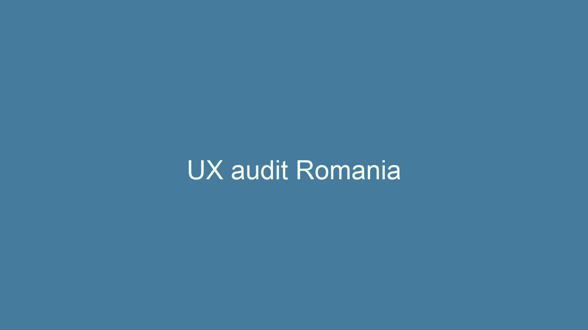

Meta title: Web design Romania: site-uri care convertesc
Meta description: Web design Romania livrat de specialisti cu cercetare UX, studii de piata si dezvoltare rapida pentru crestere predictibila.

# Web design Romania: ghid complet pentru afaceri competitive

Web design Romania reprezinta startul oricarei strategii digitale serioase pentru companiile care vor sa fie vizibile si profitabile. In primele cinci secunde, vizitatorul decide daca ramane pe site sau nu, iar un design confuz poate spulbera peste 80% din sansele de conversie. Experienta noastra arata ca proiectele care pornesc de la obiective clare de business reusesc sa transforme traficul in clienti platitori.

Competitia pentru web design Romania s-a intensificat dupa ce bugetele de marketing digital din tara au crescut cu 25% in 2024 conform raportului IAB Romania. Tot mai multe companii investesc in SEO, campanii PPC si marketing automation, iar site-ul devine centrul tuturor acestor initiative. Fara structura potrivita, chiar si campaniile cu bugete mari ajung sa fie ineficiente.

## Web design Romania si contextul pietei digitale

Analizand datele eCommerceDB, piata online din Romania a depasit pragul de 8.3 miliarde de euro in 2023, cu o crestere anuala de 13%. In acelasi timp, costul mediu pe clic in Google Ads a crescut cu 18%, ceea ce inseamna ca fiecare vizita pe site este mai scumpa ca oricand. Un site lent sau dificil de navigat consuma bugetul fara sa livreze lead-uri calificate.

Pentru a ramane competitivi, brandurile care vizeaza web design Romania trebuie sa isi cunoasca audienta in detaliu: obiceiurile de navigare, dispozitivele folosite si factorii care declanseaza increderea. Monitorizam constant studiile GPeC si GWI care arata ca 64% dintre utilizatorii romani abandoneaza cosul daca procesul este greoi, iar 47% renunta instant cand site-ul nu se incarca sub 3 secunde. Cu astfel de date la baza, arhitectura informatiilor devine un exercitiu de precizie, nu o intuitie.

Un alt indice pentru web design Romania este bounce rate-ul mediu raportat de Hotjar pentru site-urile locale: 54% pe mobile si 38% pe desktop. Reducem aceste valori prin structuri clare de navigatie, teste A/B recurente si microcopy care raspunde direct intrebarii principale a vizitatorului. In plus, folosirea datelor din heatmap-uri ne ajuta sa fixam zonele fierbinti si sa amplasam call-to-action-urile in mod strategic.

Urmatorul concept vizual sintetizeaza modul in care structuram mai intai mesajul, apoi conturam flow-ul de interactiune pentru a mentine coerenta narativa in fiecare etapa a funnel-ului digital.

Imaginea prezinta un storyboard dintr-un proiect de web design Romania pentru un brand B2B care avea provocari in explicarea produsului. Am suprapus datele din interviuri cu clienti peste harta parcursului utilizatorului pentru a decide ce elemente trebuie sa apara above the fold si ce dovezi trebuie sa sustina promisiunile.

## Cum sa planifici web design Romania orientat spre conversii

Planificarea pentru web design Romania incepe cu definirea obiectivelor SMART: ce volum de lead-uri vrei lunar, ce valoare medie are o conversie si cum masori succesul. Fara acest cadru, discutiile despre cromatica si fonturi raman simple preferinte estetice care nu duc la rezultate concrete. Noi structuram planul in sprinturi, fiecare avand livrabile clare si indicatori de performanta masurabili.

### Audit de business si public tinta

Primul pas real in web design Romania este auditul de business si public tinta, nu conceptul grafic. Analizam pozitionarea brandului, segmentele de clienti si mesajele concurentilor pentru a identifica goluri de comunicare. Survey-urile trimise catre clienti existenti dezvaluie motivele pentru care au ales brandul si barierele care au ingreunat decizia.

Rezultatul auditului se transforma intr-o matrice problem-solution care ne arata ce intrebari apar pe parcursul deciziei si ce raspunsuri trebuie sa ofere site-ul. Pentru companiile de servicii, punem accent pe recenzii verificabile, studii de caz detaliate si grafice cu rezultate masurabile. Pentru e-commerce, ne concentram pe argumente legate de livrare, retur, garantie si suport post-vanzare.

### Arhitectura informatiei adaptata pietei locale

Construim arhitectura informatiei pe baza intentiilor de cautare reale extrase din Google Search Console si Ahrefs, filtrate pe web design Romania si industriile conexe. Acest proces ne permite sa mapam fiecare pagina la un cluster semantic, asigurand relevanta SEO si o navigare intuitiva pentru utilizatori. Orice pagina care nu serveste unui obiectiv de business sau unui termen de cautare cu potential este eliminata pentru a reduce zgomotul.

Structurile de tip pillar si topic cluster functioneaza excelent in Romania, pentru ca audientele inca apreciaza ghidurile complete, mai ales in industriile B2B. Integram in fiecare cluster dovezi specifice pietei locale precum reglementari, exemple de parteneri si comparatii de preturi, astfel incat continutul sa ramana ancorat in realitatea din teren. Aceasta etapa stabileste coloana vertebrala a proiectului si reduce semnificativ reviziile ulterioare.

### UX writing si microinteractiuni

Microcopy-ul este un factor adesea ignorat in proiectele de web design Romania, desi poate creste rata de conversie cu pana la 20% conform studiului Nielsen Norman Group. Testam variante de text pentru butoane, validari de formular si mesaje de eroare astfel incat tonul sa fie coerent cu brandul si sa elimine fricile utilizatorilor. Microinteractiunile sunt programate sa ofere feedback instant, reducand sentimentul de incertitudine.

Pe mobile, acordam atentie gesturilor naturale si pozitionam butoanele principale in zona de deget mare pentru a minimiza efortul utilizatorului. Oferim confirmari vizuale clare la fiecare actiune cheie si folosim animatii subtile sub 200 ms pentru a nu incetini incarcarea. Toate aceste decizii sunt documentate in design system pentru a pastra consistenta in iteratiile viitoare.

## Instrumente si tehnologii pentru web design Romania

Selectia instrumentelor tehnice pentru web design Romania depinde de complexitatea proiectului, buget si resurse interne de mentenanta. Pentru companiile care vor sa autoadministreze continutul, recomandam CMS-uri headless precum Storyblok sau Sanity conectate la front-end-uri construite in Astro ori Next.js. Aceasta structura ofera viteza, flexibilitate si posibilitatea de a activa experiente personalizate.

Pentru proiectele orientate spre e-commerce, Shopify si WooCommerce raman solutii solide in Romania, in special cand sunt integrate cu ERP-uri locale si procesatori de plati precum Netopia sau EuPlatesc. Implementam sistemele de plata cu tokenizare si 3D Secure 2 pentru a creste increderea utilizatorilor. In paralel, monitorizam performanta serverelor prin instrumente precum GTmetrix, PageSpeed Insights si New Relic.

Automatizarea marketingului completeaza strategia de web design Romania, pentru ca vizitatorii sa primeasca mesaje relevante dupa plecarea de pe site. Integram ActiveCampaign, HubSpot sau Omnisend pentru a declansa secvente de nurturing bazate pe comportament si sursa traficului. Astfel, crestem valoarea pe termen lung a fiecarui lead si transformam site-ul intr-un hub de date utile pentru vanzari.

### Performanta tehnica si Core Web Vitals

Core Web Vitals sunt reperul tehnic principal pentru web design Romania in 2025, iar Google pune accent pe Largest Contentful Paint sub 2.5 secunde, First Input Delay sub 100 ms si Cumulative Layout Shift sub 0.1. Folosim lazy loading pentru imagini, preconectam resursele esentiale si implementam caching server-side pentru a mentine indicatorii verzi. In proiectele mari, rulam audituri lunare Lighthouse si folosim servere edge pentru livrarea continutului.

Optimizam si partea de accesibilitate prin teste cu screen readers, contrast ridicat si etichete aria corecte. Multi clienti B2G au criterii obligatorii legate de standardul EN 301 549, iar conformarea aduce beneficii si in mediul privat. Documentam aceste reguli intr-un ghid usor de actualizat astfel incat echipele interne sa nu piarda timpul la fiecare componenta noua.

## Cum sa alegi furnizorul potrivit de web design Romania

Alegerea agentiei de web design Romania nu se reduce la intrebarea cat costa un site, ci la modul in care echipa intelege obiectivele de business. Cerem intotdeauna acces la datele de analytics existente, discutam cu echipa de vanzari si verificam daca exista procese pentru generarea continutului intern. Doar asa putem evita livrarea unui produs frumos, dar deconectat de realitatea comerciala.

In procesul de selectie, recomandam un scoring pe trei piloni: expertiza demonstrata, metodologie si capacitatea de implementare tehnica. Expertii in web design Romania ar trebui sa prezinte studii de caz cu metrici clare, nu doar machete estetice. Cereti sa vedeti cum au abordat testarea, ce instrumente folosesc pentru project management si cum gestioneaza lansarile graduale.

Un alt semn de profesionalism este transparenta asupra resurselor implicate si a disponibilitatii post-lansare. Un site modern are nevoie de optimizari continue, iar o agentie serioasa de web design Romania va include in oferta planuri de mentenanta, sprinturi de imbunatatire si sesiuni de raportare. Lipsa acestor detalii indica faptul ca proiectul va ramane fara suport dupa go-live.

### Intrebari cheie in etapa de negociere

Inainte de a semna contractul, pregateste un set de intrebari care sa verifice daca partenerul de web design Romania are procese solide. Intreaba cum colecteaza feedback-ul, cum prioritizeaza cerintele si ce se intampla cand apar blocaje de resurse. Discuta si despre ownership-ul codului, pentru a te asigura ca poti migra proiectul la nevoie.

Negocierea corecta include si definirea indicatorilor de performanta: rata de conversie tinta, scoruri de usability si timpi de incarcare. Stabileste etape de verificare fie la doua saptamani, fie la finalul fiecarui sprint, astfel incat ajustarile sa fie rapide si documentate. O colaborare sanatoasa se vede din modul in care partenerul planifica riscurile si comunica transparent.

## Costuri si bugete pentru web design Romania

Structurarea bugetului pentru web design Romania depinde de tipul de proiect si de resursele interne care pot acoperi continutul, fotografia sau integrarea cu sistemele existente. In medie, un site corporate personalizat porneste de la 6000 de euro si poate ajunge la 20.000 de euro cand include portaluri pentru clienti sau configuratoare complexe. Important este sa prioritizezi functionalitatile cu impact direct asupra veniturilor.

Pe langa costul initial, adauga in plan si bugetul de mentenanta, hosting performant si licente software. Pentru site-urile ce folosesc headless CMS, abonamentele variaza intre 25 si 150 de euro pe luna, in functie de numarul de utilizatori si volum de trafic. Investitia in monitorizare si securitate reduce riscul de downtime care poate genera pierderi de mii de euro intr-o singura zi.

Un calcul simplificat pe care il folosim in consultanta este raportul dintre valoarea medie a unui client nou si costul total al proiectului de web design Romania. Daca un client valoreaza 1200 de euro si site-ul poate genera 10 clienti noi pe luna, investitia devine profitabila in mai putin de sase luni. Acest mod de gandire transforma discutia despre pret intr-una despre rentabilitate.

## Studiu de caz: rezultate obtinute cu web design Romania

In ultimii trei ani am coordonat peste 40 de proiecte de web design Romania, iar trei exemple recente ilustreaza impactul unui proces riguros. Atelier Creativ Cluj a avut nevoie sa isi explice serviciile de design interior pentru publicul corporate, iar prin storytelling, fotografii autentice si pricing transparent am crescut traficul organic cu 140% si cererile de oferta saptamanale s-au dublat. FinStart, o platforma SaaS fintech, a trecut printr-un redesign complet al flow-ului de trial si a obtinut cu 68% mai multe abonamente platite datorita onboarding-ului ghidat.

Pentru EcoRide, un scale-up de mobilitate urbana, am folosit web design Romania pentru a creste conversia lead-urilor B2B la 5.2%. Cheia a fost integrarea datelor din CRM direct in paginile de destinatie, astfel incat potentialii clienti sa primeasca oferte dinamice bazate pe marimea flotei. Am adaugat si un calculator de economii estimative legat de taxonomia UE privind emisiile, iar timpul mediu pe pagina a crescut la 3 minute si 40 de secunde.

Pentru a sustine procesul de vanzare, am creat dashboard-uri personalizate care arata clar KPI-urile livrate si modul in care se aliniaza cu obiectivele financiare. Echipele interne primesc astfel un suport vizual usor de prezentat stakeholderilor, iar deciziile de marketing sunt documentate cu indicatori numerici.

Mai jos este un exemplu de dashboard folosit in proiectele de web design Romania pentru a sumariza performanta pe funnel, de la sesiuni organice pana la contracte semnate.

## Continut si SEO pentru web design Romania

Orice proiect de web design Romania trebuie sa includa un plan editorial coerent, altfel paginile raman goale si nu atrag vizitatori calificati. Incepem cu un calendar de 90 de zile in care mixam articole educationale, studii de caz si pagini de vanzare cu intentii comerciale ridicate. Fiecare piesa de continut este optimizata atat pentru SERP-uri, cat si pentru distribuirea pe LinkedIn sau newsletter.

Lucram cu jurnalisti si specialisti in industrie pentru a produce materiale credibile, iar sursele sunt verificate si citate corespunzator. Google pune accent pe E-E-A-T, iar brandurile care publica experiente reale obtin un timp mediu pe pagina cu 35% mai mare. Integram si elemente interactive precum calculatoare, quiz-uri sau download-uri de ghiduri pentru a colecta lead-uri calificate.

Optimizarea on-page include structuri H2 si H3 coerente, schema markup relevante si meta descrieri care raspund la intentia de cautare. Folosim fraze naturale, evitam keyword stuffing si ne bazam pe analize semantice LSI pentru a acoperi subteme conexe. Dupa lansare, urmarim evolutia pozitiilor in Search Console si rafinam continutul la fiecare 30 de zile.

## Analiza datelor si iteratii continue in web design Romania

Un site performeaza doar daca masori constant, iar web design Romania este un proces continuu, nu un proiect one-off. Implementam tablouri de bord in Looker Studio cu date din Google Analytics 4, CRM si platforme de email marketing pentru a avea o imagine completa. La fiecare sfarsit de luna, revizuim indicatorii si decidem ce experimente merita rulate in sprintul urmator.

Testing-ul A/B este planificat in functie de prioritatea ipotezelor si de traficul disponibil. Pentru paginile cu volum mediu, folosim testele secventiale care reduc timpul necesar validarii. Cand experimentul confirma ipoteza, actualizam design system-ul, astfel incat imbunatatirea sa devina standard pentru tot proiectul.

Feedback-ul utilizatorilor este colectat prin sondaje in-site, interviuri la cald si analize ale sesiunilor inregistrate. In proiectele B2B, completam acest set de date cu discutii cu echipele de vanzari pentru a vedea ce argumente functioneaza in convorbiri si cum le putem integra in pagini. Asa asiguram coerenta dintre mesajul online si propunerea comerciala reala.

## Checklist rapid pentru web design Romania

Inainte de lansare, folosim un checklist in 40 de puncte pentru a verifica toate componentele esentiale de web design Romania. Verificam daca toate formularele trimit emailurile catre destinatarul corect, daca paginile de multumire au tracking pentru conversii si daca fiecare asset media este optimizat pentru dimensiune si accesibilitate. Un proiect nu pleaca live pana cand fiecare punct este bifat si documentat.

Checklist-ul include revizuirea continuturilor legale, actualizarea politicii de confidentialitate si testarea pe diferite browsere si dispozitive. Folosim BrowserStack pentru a acoperi combinatii de device-uri pe care echipa nu le are fizic la dispozitie. In final, simulam scenarii de trafic intens pentru a observa comportamentul serverului si a evita surprizele in campaniile de lansare.

## Perspective viitoare pentru web design Romania

Perspectivele pentru web design Romania in 2025 sunt marcate de adoptarea tot mai mare a experientelor personalizate prin AI si de cresterea cerintelor de securitate cibernetica. Clientii se asteapta la interactiuni instant, iar echipele de marketing trebuie sa mentina un echilibru intre automatizare si controlul datelor personale. In acelasi timp, reglementarile privind accesibilitatea devin obligatorii pentru tot mai multe domenii.

Observam un interes crescut pentru designuri modulare care pot fi actualizate rapid fara interventia dezvoltatorilor. Sistemele de design bine documentate permit lansarea de pagini noi in cateva ore, nu in saptamani. Aceasta agilitate devine un avantaj competitiv major, mai ales in pietele in care competitorii lanseaza campanii dese si testeaza mesaje variate.

De asemenea, ponderea accesarii mobile continua sa creasca, iar 5G aduce oportunitati pentru continut bogat, fara a sacrifica viteza. Insa acest avantaj vine cu responsabilitatea de a optimiza fisierele media si de a planifica fallback-uri pentru zonele cu acoperire slaba. Un partener de web design Romania atent la aceste detalii va asigura experiente consistente indiferent de context.

## Concluzie si call to action

Web design Romania nu inseamna doar un site frumos, ci o infrastructura digitala care sustine vanzarile, comunicarea si reputatia brandului. Atunci cand combini date reale, UX riguros si executie tehnica impecabila, fiecare pagina devine o investitie cu ROI predictibil. Nu lasa proiectul sa se opreasca la lansare; continua sa testezi, sa inveti si sa imbunatatesti.

Daca vrei sa transformi web design Romania intr-un avantaj competitiv, programeaza o sesiune de consultanta cu echipa noastra. Iti aratam cum sa aliniezi obiectivele de business cu experienta vizitatorului si cum sa construiesti un roadmap realist pentru urmatoarele sase luni. Contacteaza-ne astazi pentru a porni proiectul cu claritate, ritm si rezultate masurabile.
